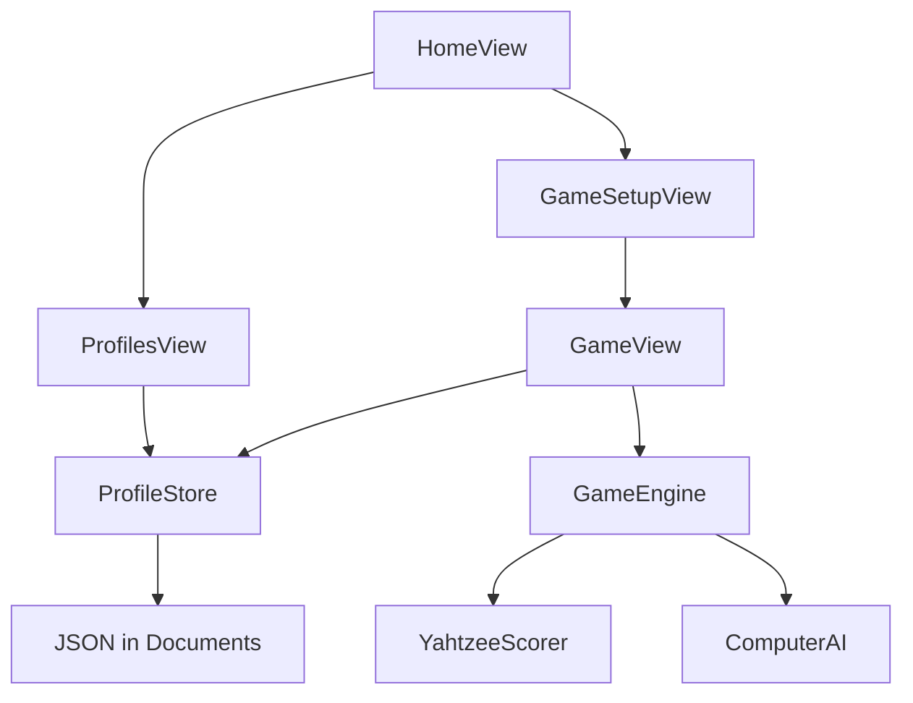

# Plan: Yahtzee-app voor kids (SwiftUI)

## Doel

Een eenvoudige, lokale Yahtzee-app in Swift/SwiftUI (Xcode) waarmee kinderen:
- een profiel hebben met bijgehouden overwinningen;
- tegen elkaar spelen op één apparaat;
- solo tegen de computer spelen;
- klassiek Yahtzee spelen inclusief Yahtzee-bonus (100).

## Scope (MVP)

Inbegrepen:
- Profielen aanmaken / hernoemen / verwijderen
- Wins + games played (lokaal)
- Game modes: versus vrienden (2–4) en versus computer
- 5 dobbelstenen, max 3 worpen, vasthouden
- Scoreblad boven + onder + totalen
- Bovenbonus 35 (≥63)
- Yahtzee 50 + bonus 100 per extra Yahtzee (+ jokerregel)
- Korte dobbelanimatie
- Eenvoudige computer-AI

Niet in MVP:
- Online multiplayer / accounts
- Game Center
- iCloud-sync
- Sound pack / Game Center leaderboards
- Custom house rules

## Architectuur

- **Models** — pure data (`Die`, `ScoreCategory`, `Scorecard`, `PlayerProfile`)
- **YahtzeeScorer** — alle puntregels op één plek (makkelijk te testen)
- **GameEngine** — beurtstatus, gooien, scoren, einde spel
- **ComputerAI** — heuristiek voor hold/score
- **ProfileStore** — `@Observable` + JSON persistence
- **SwiftUI** — home, setup, game, profielen; felt-groene kindvriendelijke look

## Schermen

1. **Home** — merk + twee modes + profielen
2. **Profielen** — lijst, wins, toevoegen/verwijderen
3. **Setup** — spelers kiezen, start
4. **Spel** — dobbelstenen, worpen-teller, scoreblad, resultaat-overlay

## Tesplan

- Unit tests voor scoring (incl. bonus/joker)
- ProfileStore win-registratie + persistence
- AI kiest Yahtzee wanneer mogelijk
- Engine: roll → score → volgende speler

## Openen

Zie [README.md](README.md): `xcodegen generate` daarna `open Yahtzee.xcodeproj`.
